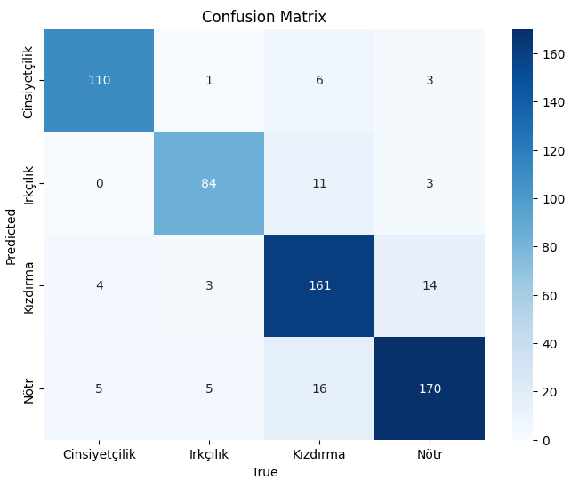
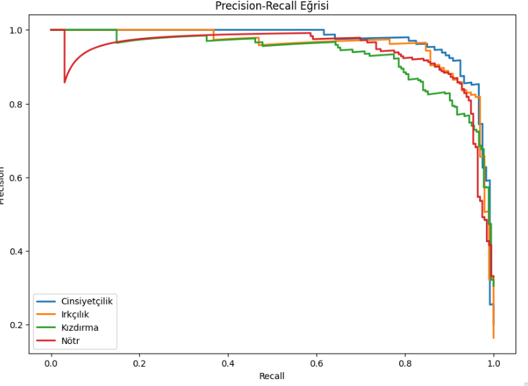
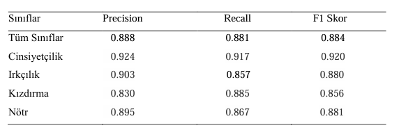
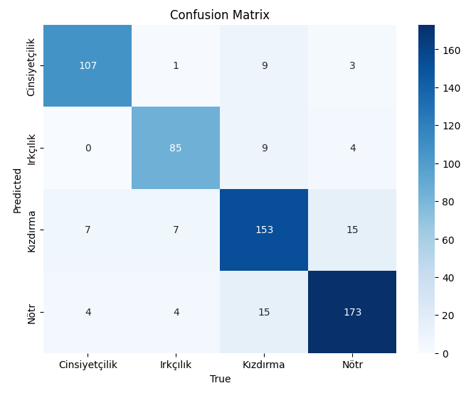
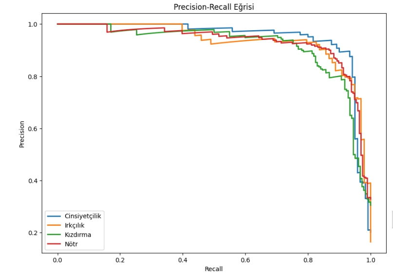
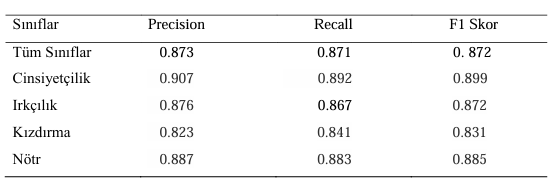
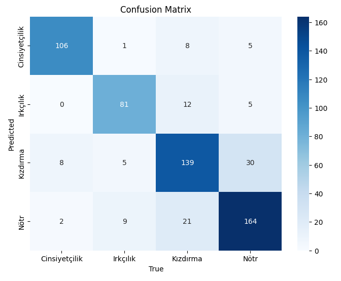
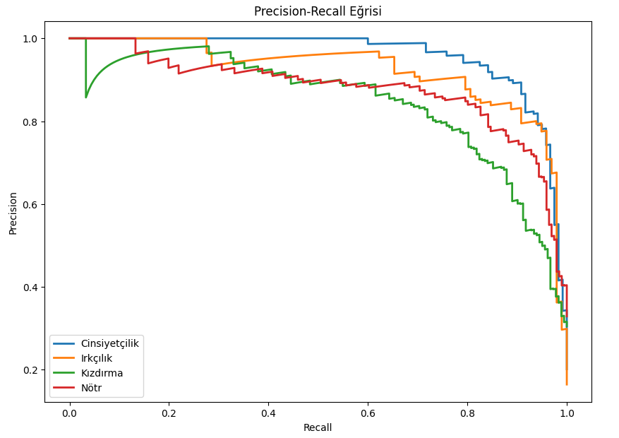
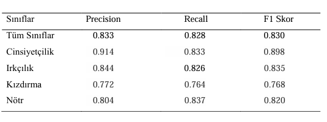

# TurkishCyberbullying 👩🏼‍💻👨🏼‍💻

## İçindekiler

- [Proje Açıklaması](#proje-açıklaması)
- [Kullanılan Modeller](#Modeller)
- [Kurulum](#kurulum)
- [Sonuçlar](#Sonuçlar)
- [Ek](#ek)
- [Katkıda Bulunma](#katkıda-bulunma)


## Proje Açıklaması

Bu proje, Türkçe X (eski adıyla twitter) verileri kullanılarak oluşturulan 4 kategorili: 
- Nötr
- Kızdırma 
- Irkçılık
- Cinsiyetçilik 

veri seti ile BERT, ConvBERT ve DistilBERT modellerinin fine-tune edilmesini ele alır. Çalışma çok sınıflı metin sınıflandırma projesidir. Çalışmada [nanelimon/turkish-social-media-offensive-dataset](https://huggingface.co/datasets/nanelimon/turkish-social-media-offensive-dataset) veri seti kullanılmıştır. 

## Kullanılan Modeller

Çalışmada Wikipedia dökümü, çeşitli OPUS korpusları ve Kemal Oflazer tarafından sağlanan özel bir korpus üzerinde eğitilen [BERTurk](https://huggingface.co/dbmdz/bert-base-turkish-uncased), [ConvBERTurk](https://huggingface.co/dbmdz/convbert-base-turkish-mc4-cased), [DistilBERTurk](https://huggingface.co/dbmdz/distilbert-base-turkish-cased) modelleri kullanılmıştır.


## Kurulum

Bu projeyi yerel ortamınıza kurmak için aşağıdaki adımları izleyin:

### 1. Depoyu klonlayın:
   ```bash
   git clone hhttps://github.com/BilgeNurBekar/TurkishCyberbullying.git
   ``` 

### 2. Proje dizinine gidin:

```bash
cd TurkishCyberbullying
 ```

### 3. Sanal ortamı oluşturun:

```python
python -m venv ./venv
```

### 4. Sanal ortamı etkinleştirin:

- Windows için:

    ```bash
    .\venv\Scripts\activate
    ```

- Unix veya MacOS için:

    ```bash
    source venv/bin/activate
    ```

### 5. Gerekli bağımlılıkları yükleyin:

```python
pip install -r requirements.txt
```

## Sonuçlar 

### BERTurk 

#### Confusion Matrix



#### Precision - Recall Curve (PR Curve)



#### Results Table 




### ConvBERTurk 

#### Confusion Matrix



#### Precision - Recall Curve (PR Curve)



#### Results Table 




### DistilBERTurk 

#### Confusion Matrix



#### Precision - Recall Curve (PR Curve)



#### Results Table 




## Ek

Çalışmada oluşturulan modelleri kullanmak, eğitmek için [HuggingFace](https://huggingface.co/) platformu üzerinden [AIZinu](https://huggingface.co/AIZinu) profilindeki modelleri inceleyebilirsiniz. 

Çalışmanın API' ı için [FASTAPI](https://github.com/BilgeNurBekar/TurkishCyberbullyingFastAPI) reposunu incelemeyi unutmayın ☄️


## Katkıda Bulunma

Katkıda bulunmak isterseniz, lütfen aşağıdaki adımları takip edin:

Depoyu fork edin.

Yeni bir branch oluşturun: git checkout -b feature/ozellik-adi

Değişikliklerinizi yapın ve commit edin.

Pull request açın.

Çalışmayı beğendiyseniz yıldızlamayı unutmayın ⭐️